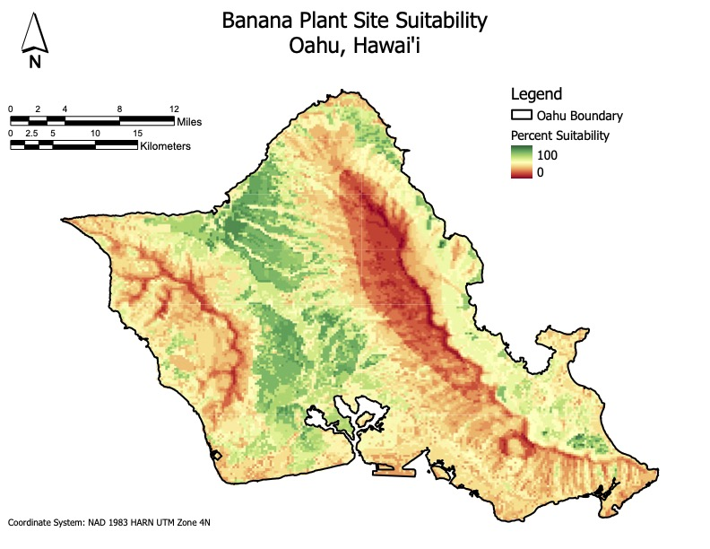

## Portfolio

---

### ArcGIS Pro Projects

[Transitshed](/pdf/transitshed.pdf) - Using the Network Analysis extension, created 45-minute transhitsheds for the highschools located in Austin Independent School District, as part of a lab assignment.

  
 

---
[Hotspot Analysis](/pdf/hotspot_analysis.pdf) - Using crime data from the City of Chicago (from June 2020 to June 2021), two hot spot analyses were performed, Global Moran's I and Getis-Ord General G, as part of a lab assignment.

  
&nbsp; &nbsp; &nbsp; &nbsp;
  

<!--    -->

---
[Spatial Interpolation](/pdf/spatial_interpolation.pdf) - Used two basic spatial interpolation techniques, Kriging and inverse Distance Weighted(IDW), to estimate and compare surface temperatures across the state of Texas, as part of a lab assignment.

  
&nbsp; &nbsp; &nbsp; &nbsp;
  

<!--    -->

---
---

### ArcGIS StoryMap Projects

- [Locating Appealing Sites for Banana Plants on Oahu, Hawai'i using MCDA](https://storymaps.arcgis.com/stories/4f7f146bc3af4daca2d5d8f0a5f62b6d) - used MCDA and a set of five criteria to locate suitabile locations on the island of Oahu, as part of a final project assignment.

<!-- - [Project 2 Title](http://example.com/) -->
<!-- - [Project 3 Title](http://example.com/) -->
<!-- - [Project 4 Title](http://example.com/) -->
<!-- - [Project 5 Title](http://example.com/) -->

---
---

### Google Earth Engine

[Sentinel-2 for Fire Monitoring](https://msteffes.users.earthengine.app/view/sentinelfiremonitoring) - used Sentinel-2 to monitor before and after a fire, represented in a Split Panel App.

---

---

Page template forked from <a href="https://github.com/evanca/quick-portfolio">evanca</a>

<!-- Remove above link if you don't want to attibute -->

<!-- comment format -->
